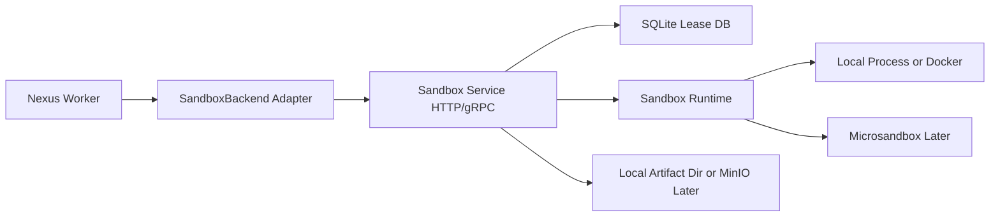

# Standalone Sandbox Service Plan

## Recommended Shape

Build a small Python service that acts as the compute-plane boundary for sandbox lifecycle, file operations, command execution, and artifact export. Keep it separate from the main API/worker, and have the future Nexus worker call it through a `SandboxBackend` adapter matching the planned contract:

```python
class SandboxBackend:
    async def create_session(self, workspace_id, image, limits): ...
    async def exec(self, session_id, command, timeout): ...
    async def write_file(self, session_id, path, content): ...
    async def read_file(self, session_id, path): ...
    async def sync_to_artifacts(self, session_id): ...
    async def stop_session(self, session_id): ...
```

Use **HTTP/FastAPI first** for ease of local development and debugging. Add **gRPC later** only where it is materially better, mainly streaming command output and high-volume file transfer. If you know the control plane and worker will also be Python, HTTP is enough for MVP.

## High-Level Architecture



The service should persist **leases and metadata**, not treat SQLite as the source of truth for user/project data. SQLite tracks what sandbox sessions exist, their lifecycle, limits, paths, heartbeats, and recent exec records. Actual durable outputs should eventually move to object storage.

## Suggested Python Layout

- `sandbox_service/main.py`: FastAPI app, startup/shutdown, middleware.
- `sandbox_service/api/routes.py`: HTTP endpoints.
- `sandbox_service/models.py`: Pydantic request/response models.
- `sandbox_service/db.py`: SQLite connection/session setup.
- `sandbox_service/repositories.py`: sessions, execs, file metadata.
- `sandbox_service/runtime/base.py`: abstract runtime interface.
- `sandbox_service/runtime/local.py`: MVP backend using local temp dirs and subprocesses.
- `sandbox_service/runtime/docker.py`: optional safer local backend.
- `sandbox_service/runtime/microsandbox.py`: future Microsandbox backend.
- `sandbox_service/artifacts.py`: package/export files from sandbox workspace.
- `sandbox_service/config.py`: env-driven settings.
- `proto/sandbox.proto`: optional gRPC contract once streaming is needed.

## SQLite Tables

Start with a narrow schema:

- `sandbox_sessions`: `id`, `workspace_id`, `run_id`, `image`, `status`, `backend`, `root_path`, `limits_json`, `metadata_json`, `created_at`, `expires_at`, `last_heartbeat_at`, `stopped_at`.
- `execs`: `id`, `session_id`, `command`, `cwd`, `status`, `exit_code`, `stdout_path`, `stderr_path`, `started_at`, `finished_at`, `timeout_seconds`.
- `files`: `id`, `session_id`, `path`, `size_bytes`, `sha256`, `updated_at`.
- `artifacts`: `id`, `session_id`, `source_path`, `artifact_uri`, `size_bytes`, `sha256`, `created_at`.

Use UUIDs for public IDs. Keep stdout/stderr bodies on disk, not inline in SQLite, to avoid bloating the local DB.

## Core HTTP Endpoints

### Health and Introspection

- `GET /healthz`: liveness check.
- `GET /readyz`: verifies SQLite and runtime backend are usable.
- `GET /v1/backends`: returns supported runtime backends and capabilities.

### Session Lifecycle

- `POST /v1/sessions`: create a sandbox session.
- `GET /v1/sessions/{session_id}`: get status, limits, timestamps, backend info.
- `GET /v1/sessions`: list sessions, filtered by `workspace_id`, `run_id`, `status`.
- `POST /v1/sessions/{session_id}/heartbeat`: extend or confirm lease ownership.
- `POST /v1/sessions/{session_id}/stop`: stop gracefully.
- `DELETE /v1/sessions/{session_id}`: stop and remove local working data if policy allows.

### Execution

- `POST /v1/sessions/{session_id}/execs`: run a command. MVP can be synchronous with timeout.
- `GET /v1/sessions/{session_id}/execs/{exec_id}`: get exec status and exit code.
- `GET /v1/sessions/{session_id}/execs/{exec_id}/stdout`: fetch stdout, optionally with `offset`.
- `GET /v1/sessions/{session_id}/execs/{exec_id}/stderr`: fetch stderr, optionally with `offset`.
- Later: `GET /v1/sessions/{session_id}/execs/{exec_id}/events`: SSE stream for stdout/stderr/status.

### Filesystem

- `PUT /v1/sessions/{session_id}/files`: write or overwrite a file by path.
- `GET /v1/sessions/{session_id}/files`: read a file by path.
- `GET /v1/sessions/{session_id}/files/list`: list files under a directory.
- `DELETE /v1/sessions/{session_id}/files`: delete a file or directory.
- `POST /v1/sessions/{session_id}/files/archive`: upload/extract a tar or zip into the sandbox.
- `GET /v1/sessions/{session_id}/files/archive`: download a directory as tar or zip.

### Artifact Sync

- `POST /v1/sessions/{session_id}/artifacts/sync`: export selected paths to artifact storage.
- `GET /v1/sessions/{session_id}/artifacts`: list exported artifacts.

### Cleanup and Operations

- `POST /v1/gc`: admin-only cleanup of expired sessions and old exec logs.
- `GET /v1/metrics`: Prometheus-style metrics later, optional for MVP.

## Example Request Shapes

Create session:

```json
{
  "workspace_id": "ws_123",
  "run_id": "run_456",
  "image": "python:3.12-slim",
  "backend": "local",
  "limits": {
    "cpu": 1,
    "memory_mb": 1024,
    "disk_mb": 2048,
    "timeout_seconds": 300,
    "network": "disabled"
  },
  "metadata": {
    "purpose": "agent_tool_execution"
  }
}
```

Execute command:

```json
{
  "command": "python main.py",
  "cwd": "/workspace",
  "timeout_seconds": 60,
  "env": {
    "PYTHONUNBUFFERED": "1"
  }
}
```

Write file:

```json
{
  "path": "/workspace/main.py",
  "content_base64": "cHJpbnQoJ2hlbGxvJykK",
  "mode": "0644"
}
```

Sync artifacts:

```json
{
  "paths": ["/workspace/output"],
  "destination_prefix": "runs/run_456/artifacts",
  "include_globs": ["**/*"],
  "exclude_globs": [".venv/**", "__pycache__/**"]
}
```

## gRPC Mapping

If adding gRPC, keep it equivalent to the HTTP API:

- `CreateSession(CreateSessionRequest) returns (Session)`
- `GetSession(GetSessionRequest) returns (Session)`
- `ListSessions(ListSessionsRequest) returns (ListSessionsResponse)`
- `Heartbeat(HeartbeatRequest) returns (Session)`
- `StopSession(StopSessionRequest) returns (Session)`
- `Exec(ExecRequest) returns (ExecResult)` for simple synchronous commands.
- `ExecStream(ExecRequest) returns (stream ExecEvent)` for real-time logs.
- `WriteFile(WriteFileRequest) returns (FileInfo)`
- `ReadFile(ReadFileRequest) returns (FileContent)`
- `UploadArchive(stream UploadArchiveChunk) returns (ArchiveResult)`
- `DownloadArchive(DownloadArchiveRequest) returns (stream ArchiveChunk)`
- `SyncArtifacts(SyncArtifactsRequest) returns (SyncArtifactsResponse)`

## MVP Build Order

1. Implement FastAPI service with SQLite, health checks, session lifecycle, local runtime root dirs, and sync command execution.
2. Add file read/write/list/archive operations with path normalization and sandbox-root containment checks.
3. Add exec log persistence to files plus stdout/stderr fetch endpoints.
4. Add lease expiry and garbage collection for stopped/expired sessions.
5. Add artifact sync to a local artifact directory, returning stable artifact URIs.
6. Add a Python client implementing the planned `SandboxBackend` interface.
7. Add Docker or Microsandbox runtime behind the same runtime interface.
8. Add SSE or gRPC streaming only after basic command execution works reliably.

## Guardrails To Include From Day One

- Reject paths that escape the sandbox root using `..`, symlinks, or absolute host paths.
- Require per-command timeout and max output size.
- Store secrets as references; do not persist raw secret values in SQLite or logs.
- Default network to disabled or restricted.
- Add session TTL and automatic cleanup.
- Keep auth simple locally, such as an internal bearer token, but design endpoints as private service-to-service APIs.
- Treat local subprocess runtime as development-only; use Docker or Microsandbox before running untrusted code.

## Recommendation

Start with **FastAPI + SQLite + local runtime interface**, not full gRPC. Design the request/response models so a future gRPC service can mirror them exactly. This gives you fast iteration now while preserving the core boundary the Nexus docs already expect: the control plane asks for sandbox work, and the sandbox service owns execution isolation and filesystem operations.
