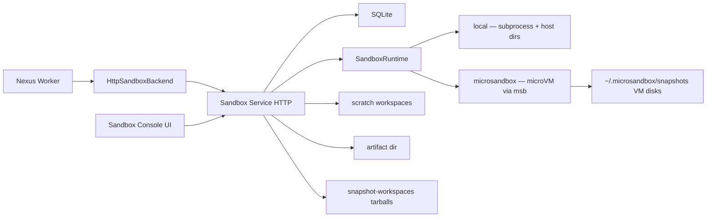

# Nexus Sandbox Service

Design reference and API contract for the standalone compute-plane service. **MVP is implemented** — this document reflects the current codebase, with future work called out explicitly.

## Purpose

A small Python service that owns sandbox lifecycle, file operations, command execution, artifact export, and (with microsandbox) VM snapshots. The Nexus worker calls it through a `SandboxBackend` HTTP adapter in `sandbox/`.

```python
class SandboxBackend:
    async def create_session(self, workspace_id, image, limits, ...): ...
    async def exec(self, session_id, command, timeout, ...): ...
    async def write_file(self, session_id, path, content): ...
    async def read_file(self, session_id, path): ...
    async def sync_to_artifacts(self, session_id, paths, destination_prefix): ...
    async def stop_session(self, session_id): ...
```

HTTP/FastAPI is the transport. gRPC/SSE streaming remain future options.

## Architecture



SQLite stores **leases and metadata** only. User file bytes live on disk under `scratch/`, `artifacts/`, `snapshot-workspaces/`, and exec logs. microsandbox VM disk snapshots are managed by `msb` outside the service data dir.

## Code Layout

| Path                                      | Role                                         |
| ----------------------------------------- | -------------------------------------------- |
| `sandbox_service/main.py`                 | FastAPI app, lifespan, optional bearer auth  |
| `sandbox_service/api/routes.py`           | HTTP endpoints                               |
| `sandbox_service/models.py`               | Pydantic request/response models             |
| `sandbox_service/db.py`                   | SQLite schema + migrations                   |
| `sandbox_service/repositories.py`         | sessions, execs, files, artifacts, snapshots |
| `sandbox_service/runtime/base.py`         | `SandboxRuntime` protocol                    |
| `sandbox_service/runtime/local.py`        | Dev backend: host dirs + subprocess          |
| `sandbox_service/runtime/microsandbox.py` | microVM backend via `microsandbox` SDK       |
| `sandbox_service/snapshot_workspace.py`   | Workspace tar.gz archive/restore             |
| `sandbox_service/artifacts.py`            | Glob-based artifact export                   |
| `sandbox_service/cleanup.py`              | Background TTL + orphan reconciliation       |
| `sandbox_service/policies.py`             | Network policy helpers                       |
| `sandbox_service/path_guard.py`           | Sandbox-root path containment                |
| `sandbox_service/config.py`               | `SANDBOX_*` settings                         |
| `sandbox/backend.py`                      | `HttpSandboxBackend` client adapter          |
| `frontend/`                               | Sandbox Console (React + Vite)               |

**Not implemented:** `runtime/docker.py`, `proto/sandbox.proto`, Prometheus metrics, object storage backend.

## Runtimes

| Backend        | Status      | Isolation                                  | Snapshots     |
| -------------- | ----------- | ------------------------------------------ | ------------- |
| `local`        | Implemented | Host subprocess + bind-mounted scratch dir | Not supported |
| `microsandbox` | Implemented | Hardware-isolated microVM (`msb`)          | Supported     |
| `docker`       | Planned     | Container                                  | —             |

`GET /v1/backends` returns per-backend capabilities: `available`, `supports_network_policy`, `supports_streaming`, `supports_snapshots`.

Network modes: `disabled`, `public`, `allowlist` (with `allowed_hosts`).

## SQLite Schema

- **`sandbox_sessions`**: `id`, `workspace_id`, `run_id`, `image`, `status`, `backend`, `root_path`, `sandbox_name`, `limits_json`, `metadata_json`, `created_at`, `expires_at`, `last_heartbeat_at`, `stopped_at`
- **`execs`**: `id`, `session_id`, `command`, `cwd`, `status`, `exit_code`, `stdout_path`, `stderr_path`, `started_at`, `finished_at`, `timeout_seconds`
- **`files`**: `id`, `session_id`, `path`, `size_bytes`, `sha256`, `updated_at`
- **`artifacts`**: `id`, `session_id`, `source_path`, `artifact_uri`, `size_bytes`, `sha256`, `created_at`
- **`snapshots`**: `id`, `workspace_id`, `source_session_id`, `name`, `msb_name`, `digest`, `image_ref`, `size_bytes`, `include_workspace`, `workspace_bytes`, `workspace_archive_path`, `metadata_json`, `created_at`

Public IDs use prefixed UUIDs (`sess_`, `exec_`, `art_`, `snap_`). stdout/stderr bodies are stored on disk under `exec-logs/`, not in SQLite.

## On-Disk Storage

Default root: `~/.nexus-sandbox` (`SANDBOX_DATA_DIR`).

| Path                                             | Contents                                              |
| ------------------------------------------------ | ----------------------------------------------------- |
| `sandbox.db`                                     | Metadata                                              |
| `scratch/<session_id>/workspace/`                | Live session workspace (bind-mounted at `/workspace`) |
| `artifacts/<session_id>/…`                       | Exported artifact copies                              |
| `snapshot-workspaces/<snap_id>/workspace.tar.gz` | Optional workspace bundle                             |
| `exec-logs/`                                     | Per-exec stdout/stderr files                          |

microsandbox VM disk artifacts: `~/.microsandbox/snapshots/<msb_name>/`

## HTTP Endpoints

### Health and Introspection

| Method | Path           | Description                        |
| ------ | -------------- | ---------------------------------- |
| `GET`  | `/healthz`     | Liveness                           |
| `GET`  | `/readyz`      | SQLite + default backend readiness |
| `GET`  | `/v1/backends` | Runtime capabilities               |

### Session Lifecycle

| Method   | Path                                  | Description                                        |
| -------- | ------------------------------------- | -------------------------------------------------- |
| `POST`   | `/v1/sessions`                        | Create session (optional `snapshot_id` to restore) |
| `GET`    | `/v1/sessions/{session_id}`           | Session details                                    |
| `GET`    | `/v1/sessions`                        | List; filter by `workspace_id`, `run_id`, `status` |
| `POST`   | `/v1/sessions/{session_id}/heartbeat` | Extend lease TTL                                   |
| `POST`   | `/v1/sessions/{session_id}/stop`      | Stop runtime, mark session stopped                 |
| `DELETE` | `/v1/sessions/{session_id}`           | Stop, remove scratch workspace, delete record      |

### Snapshots (microsandbox only)

| Method   | Path                                  | Description                                      |
| -------- | ------------------------------------- | ------------------------------------------------ |
| `POST`   | `/v1/sessions/{session_id}/snapshots` | Snapshot stopped (or stop-then-snapshot) session |
| `GET`    | `/v1/snapshots`                       | List; requires `workspace_id` query param        |
| `GET`    | `/v1/snapshots/{snapshot_id}`         | Snapshot metadata                                |
| `DELETE` | `/v1/snapshots/{snapshot_id}`         | Remove VM snapshot + workspace archive           |

Snapshot create body:

```json
{
  "name": "my-checkpoint",
  "stop_session": true,
  "include_workspace": true,
  "metadata": {}
}
```

- `stop_session` (default `true`): stop an active session before capturing; returns `409 session_not_stopped` if `false` and session is running.
- `include_workspace` (default `true`): tar.gz workspace files into `snapshot-workspaces/`. When `false`, only VM disk state is saved.

Restore: `POST /v1/sessions` with `snapshot_id` — boots microVM from disk snapshot and extracts workspace archive when present.

### Execution

| Method | Path                                               | Description                             |
| ------ | -------------------------------------------------- | --------------------------------------- |
| `POST` | `/v1/sessions/{session_id}/execs`                  | Run command (synchronous, with timeout) |
| `GET`  | `/v1/sessions/{session_id}/execs/{exec_id}`        | Exec status + exit code                 |
| `GET`  | `/v1/sessions/{session_id}/execs/{exec_id}/stdout` | Stdout bytes; optional `offset`         |
| `GET`  | `/v1/sessions/{session_id}/execs/{exec_id}/stderr` | Stderr bytes; optional `offset`         |

**Not implemented:** `GET …/execs/{exec_id}/events` (SSE stream).

### Filesystem

| Method   | Path                                      | Description                                   |
| -------- | ----------------------------------------- | --------------------------------------------- |
| `PUT`    | `/v1/sessions/{session_id}/files`         | Write file (`content_base64`, `mode`)         |
| `GET`    | `/v1/sessions/{session_id}/files`         | Read file; `path` query param                 |
| `GET`    | `/v1/sessions/{session_id}/files/list`    | List directory; optional `path` prefix        |
| `DELETE` | `/v1/sessions/{session_id}/files`         | Delete file; `path` query param               |
| `POST`   | `/v1/sessions/{session_id}/files/archive` | Upload tar/zip; `path`, `format` query params |
| `GET`    | `/v1/sessions/{session_id}/files/archive` | Download directory as tar.gz or zip           |

Host-side writes go to `session.root_path` (the scratch workspace). microsandbox bind-mounts this at `/workspace` inside the VM.

### Artifact Sync

| Method | Path                                       | Description                            |
| ------ | ------------------------------------------ | -------------------------------------- |
| `POST` | `/v1/sessions/{session_id}/artifacts/sync` | Export paths with glob include/exclude |
| `GET`  | `/v1/sessions/{session_id}/artifacts`      | List exported artifacts                |

### Operations

| Method | Path     | Description                                        |
| ------ | -------- | -------------------------------------------------- |
| `POST` | `/v1/gc` | Manual cleanup of expired sessions + old exec logs |

Background cleanup loop also runs on `cleanup_interval_seconds`. **Not implemented:** `GET /v1/metrics`.

## Example Request Shapes

Create session:

```json
{
  "workspace_id": "ws_123",
  "run_id": "run_456",
  "image": "python:3.12",
  "backend": "microsandbox",
  "limits": {
    "cpu": 1,
    "memory_mb": 1024,
    "disk_mb": 2048,
    "timeout_seconds": 300,
    "network": "disabled",
    "allowed_hosts": []
  },
  "metadata": {
    "purpose": "agent_tool_execution"
  }
}
```

Create session from snapshot:

```json
{
  "workspace_id": "ws_123",
  "snapshot_id": "snap_abc123",
  "limits": { "network": "disabled" }
}
```

Execute command:

```json
{
  "command": "python main.py",
  "cwd": "/workspace",
  "timeout_seconds": 60,
  "env": { "PYTHONUNBUFFERED": "1" }
}
```

Write file:

```json
{
  "path": "/workspace/main.py",
  "content_base64": "cHJpbnQoJ2hlbGxvJykK",
  "mode": "0644"
}
```

Sync artifacts:

```json
{
  "paths": ["/workspace/output"],
  "destination_prefix": "runs/run_456/artifacts",
  "include_globs": ["**/*"],
  "exclude_globs": [".venv/**", "__pycache__/**"]
}
```

## Configuration

All settings use `SANDBOX_` prefix (see `sandbox_service/config.py`):

| Variable                        | Default            | Notes                     |
| ------------------------------- | ------------------ | ------------------------- |
| `SANDBOX_DEFAULT_BACKEND`       | `local`            | `local` or `microsandbox` |
| `SANDBOX_DEFAULT_IMAGE`         | `python:3.12`      |                           |
| `SANDBOX_DATA_DIR`              | `~/.nexus-sandbox` |                           |
| `SANDBOX_AUTH_TOKEN`            | _(none)_           | Bearer token when set     |
| `SANDBOX_SESSION_TTL_SECONDS`   | `3600`             |                           |
| `SANDBOX_MAX_EXEC_OUTPUT_BYTES` | `10485760`         | Truncate exec output      |

## Guardrails (Implemented)

- Path containment via `path_guard` — rejects `..`, escapes outside workspace root
- Per-command timeout and max output size
- Default network disabled; allowlist mode for microsandbox
- Session TTL, heartbeat extension, background + manual GC
- Optional bearer auth on all `/v1/*` routes
- `local` backend documented as dev-only; `microsandbox` for isolated execution

## Build Status

| Item                                 | Status      |
| ------------------------------------ | ----------- |
| FastAPI + SQLite + session lifecycle | Done        |
| Local runtime (subprocess)           | Done        |
| microsandbox runtime                 | Done        |
| File read/write/list/archive         | Done        |
| Exec + stdout/stderr persistence     | Done        |
| Lease expiry + GC                    | Done        |
| Artifact sync to local dir           | Done        |
| `HttpSandboxBackend` adapter         | Done        |
| VM snapshots (microsandbox)          | Done        |
| Workspace snapshot bundling          | Done        |
| Sandbox Console UI                   | Done        |
| Docker runtime                       | Not started |
| gRPC / SSE streaming                 | Not started |
| Prometheus metrics                   | Not started |
| Object storage (MinIO/S3) artifacts  | Not started |

## Future: gRPC Mapping

If adding gRPC, mirror the HTTP API:

- `CreateSession`, `GetSession`, `ListSessions`, `Heartbeat`, `StopSession`
- `CreateSnapshot`, `ListSnapshots`, `GetSnapshot`, `DeleteSnapshot`
- `Exec`, `ExecStream` (streaming)
- `WriteFile`, `ReadFile`, `UploadArchive`, `DownloadArchive`
- `SyncArtifacts`

## Recommendation

The HTTP MVP is sufficient for Nexus worker integration. Prioritize **SSE exec streaming** or **object-storage artifacts** next only when latency or durability requirements demand it. Use `microsandbox` for any untrusted or agent-generated code; keep `local` for fast inner-loop development.
